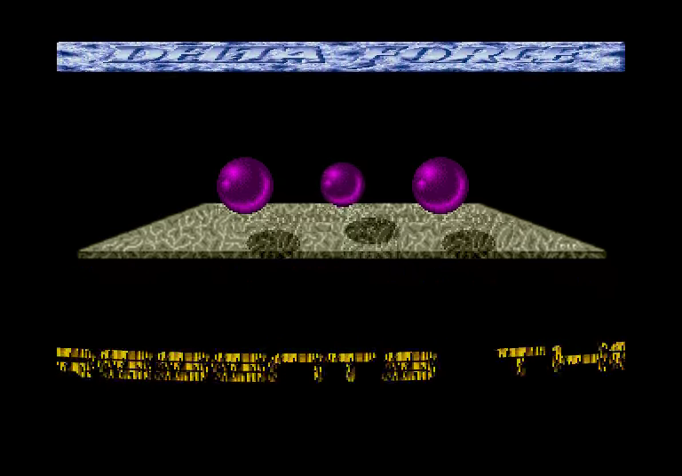
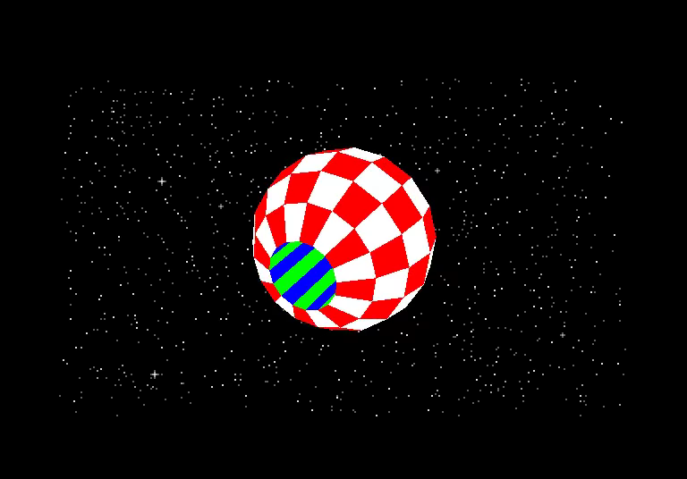
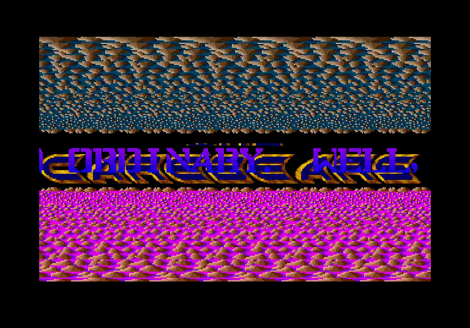
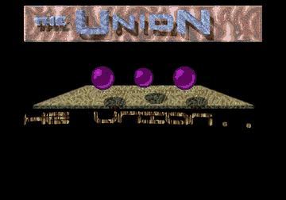

# The Union Demo

A native Go/Ebitengine production built with Democonstructionkit (DCK).
The introduction opens with a scrolling background, waving text and YM music,
then leads to the Union hall and its eleven screens with animated loading credits.
Graphics, bitmap fonts and music are embedded; playback works offline.

<!-- Project showcase -->
## Screenshots

[](docs/media/screenshot-1.png)

Music-driven purple spheres over a gold perspective plane.

[](docs/media/screenshot-2.png)

Rotating checkered solid sphere in a star field.

[](docs/media/screenshot-3.png)

Layered patterns and a rotating perspective text scroller.

## Video

[](https://github.com/olivierh59500/go-uniondemo/raw/refs/heads/main/docs/media/preview.mp4)

**[Watch or download the 24-second MP4 preview with sound](https://github.com/olivierh59500/go-uniondemo/raw/refs/heads/main/docs/media/preview.mp4)**

This short showcase combines selected passages from the Go production.

The animated image is silent; the MP4 includes the soundtrack.

<!-- End project showcase -->

## Run

Go 1.26 or newer is required. Dependencies are pinned in `go.mod`, including
YM Player v1.0.0 and a published DCK version.

```sh
go run ./cmd/uniondemo
go run ./cmd/uniondemo -screen menu
go run ./cmd/uniondemo -list
go run ./cmd/uniondemo -screen multiplane
go run ./cmd/uniondemo -tour -seconds 60
go run ./cmd/uniondemo -touch
```

Startup includes the introduction on desktop and Android. Enter, Space or the
ENTER/MENU touch button continues immediately; otherwise the menu opens after
the complete 38.42-second introduction tune. `-screen menu` starts directly in
the hall. Returning from a screen does not replay the introduction.

The fixed animation rate defaults to 60 Hz independently of display refresh.
Use `-rate 50` for 50 Hz playback, `-mute` for silent playback, or
`-skip-loader` to open screens immediately.

## Screens

| ID | Screen |
| --- | --- |
| `beatdis` | The Carebears — Beat Dis |
| `delta` | Delta Force — Spher-I-Cool |
| `tnt3` | TNT Crew — Solid 3D |
| `wow` | The Carebears — Wow Scroller |
| `hidden` | Hidden Screen |
| `starballs` | TNT Crew — Starballs |
| `replicants` | The Replicants |
| `tnt2` | TNT Crew — Layered Scroller |
| `level16` | Level 16 |
| `multiplane` | The Carebears — Multi-Plane 3D Scroller |
| `diskcopier` | TEX — Disk Copier |

## Controls

- Arrow keys: move Charly in the hall, or adjust the current effect.
- Enter/Space: enter a door; Enter also skips the loading credits.
- Escape/Backspace: return to the same place in the hall.
- Tab: screen chooser; Up/Down and Enter select an entry.
- F: fullscreen. M: mute.
- TNT3: 1–5 select the five solid objects; Space cycles them.
- Starballs: 1–9 and 0 adjust the star count; Up/Down or Action also work.
- TNT2: 1–4 select motion; arrows control direction/speed.
- Replicants: Left/Right adjust scrolling speed.
- Disk Copier: Space/Action starts the animated copy sequence; 0 stops it.

The touch overlay provides directions, ENTER, MENU, SCREENS and ACTION.
The disk-copy screen is a visual sequence and does not access disks or user files.

## Audio and effects

The introduction uses *Think Twice* in YM format. Ten screen soundtracks and
the menu also use YM playback through DCK. Beat Dis and Wow use sampled YM tracks. The hidden screen plays
Mad Max's *Thalion Forever (Feed Me Max)* as losslessly compressed PCM, retaining
its introduction and continuous musical loop. The loading transition plays its
short recorded cue once. All music is opened through
`sound.Open(filename, data, options)`, including gzip-wrapped recordings. DCK
selects the decoder and maintains the requested loop start; the demo and capture
tool contain no decoder selection or PCM conversion. Playback remains entirely
in Go.

Reusable composition, scrolling, raster deformation, sprite and mesh effects
come from DCK. Each font supplies its own atlas dimensions and ordering. The
TNT Crew 3 screen now uses `effects.SolidMeshCarousel` for its five selectable
objects, grouped face materials, rotation and recessional handoffs, and
`scrolling.CaptionCarousel` for its heading. Its model coordinates and message
text remain local scene data.
Its faceted ball now uses `effects.SolidSphereModel`; radius, latitude and
longitude divisions, checker colors and the polar closing band are editable.
The other four models keep their authored vertices and groups. A pure parity
check matched all 512 ball vertices and 112 colored faces, and complete GPU
captures at frames 1, 60, 240 and 600 remain pixel-identical.
Hidden screen now draws its four pointers through `sprites.DelayedTrail` with
editable per-image delays and order. `timeline.PacedIndex` keeps the bar and
crosshair colors one step apart; the palette and masks remain authored art.
The Delta Force balls read synchronized YM voice registers from the active stream.
Their complete sprite bank now uses DCK's `sprites.SignalFrameBank`: channel
changes, independent decay envelopes, eight atlas frames and the three
positions are configured together. Eight music-driven captures through frame
600 match the previous screen byte for byte. The host only passes its current
YM levels; the same component can accept other module or PCM signals.
On Pixel 10a, Delta Force showed 744 distinct present intervals with p95
16.720 ms, maximum 17.699 ms and none over 20 ms in twelve sampled windows.
The other Delta effects retain their shared controllers:
`motion.BounceToggle` now owns the alternating logo scale and `WrapBank` the
gold backdrop offset. `motion.EnterHoldExit` selects each title draw and the
same-tick handoff to the main scroll. Both text surfaces reuse a single
`RasterOverlay` source-atop gold material.
The credits loader now uses DCK's `timeline.CueClock` for its exact recorded
duration and reveal clock. Seven captures around its end boundary match the
previous loader pixel for pixel.
Disk Copier now selects its copy stages through `timeline.CueRanges` and its
eight palette images through `timeline.SteppedEnvelope`. The messages, controls
and LED/LCD images remain scene data. Nine captures through its early and late
copy operations match the previous screen pixel for pixel.
Its LCD strip now uses `sprites.Atlas` for cached tiles and absolute source
regions; the existing fractional-region painter and three operation clocks
keep their authored sampling behavior.
Those three operation clocks now use `motion.GatedWrapBank` with independent
start cues and a strict tile-82 wrap. Eight captures across the first wrap and
late copy operations match the previous renderer pixel for pixel.
Scene clocks advance only in Update; rendering does not advance animation.
The introduction's 32×16 waving text cells now use DCK's
`composite.HarmonicCellWarp`. It samples 14 row waves and 16 column waves once
per frame instead of evaluating two sine expressions for each of 224 cells.
Eight frames across the intro remain pixel-identical to the previous renderer.
Wow and Replicants use `composite.RasterOverlay` for their masked raster
material. Their opposite phase directions and inclusive wrap boundaries stay
editable in DCK. Replicants uses coordinates recovered from its Atari executable for thirteen
visible letters. DCK owns their cached keyframes and step sampling. The native
31-frame entry and 1,273-frame cycle retain all fourteen path banks and their
repeat counts at 50 Hz, independently of the 60 Hz host display.
The two bouncing raster banks now use DCK's
`sprites.Train` with `motion.BounceBank`; ten frames around the bounce
boundaries match the previous implementation pixel for pixel.
Beat Dis, Wow, TNT2 and Level 16 now share `motion.WrapBank` for their
independent scrolling layers. Thirty-five checkpoints, including TNT2 control
changes and strict/inclusive wrap boundaries, match the previous screens pixel
for pixel.
Level 16's moving ball now follows a `motion.TrajectoryClock` over its
`NestedOrbit` path. The controller caches its position once per frame and
retains the original advance-before-draw phase; the center, radius and phase
step remain editable production parameters.
Beat Dis also uses `motion.HarmonicFormation` and `sprites.Group` for its eight
letters. A phase table preserves their nonuniform spacing while separate clocks
control the common horizontal wobble and the individual orbits.
The menu's panorama, uncover wipe, palette, walking frames and long-held logo
pulse now use independent DCK motion/timeline controllers. Its character crop
comes from `sprites.Atlas`, while door navigation remains local. Nine captures
around the palette, panorama and logo boundaries match the previous menu pixel
for pixel.
The input-driven hall and banner also use `motion.WalkParallax` with separate
speeds and directional wrap limits. Eleven walking captures, including the
large hall wrap, match the prior menu pixel for pixel.
The automated tour's hidden-screen pointer now samples a configurable
`motion.RampedWavePath`: separate horizontal and vertical sine frequencies
rise to full amplitude over two seconds. Pure comparisons through tick 3,600
at both 50 and 60 Hz retain the former coordinates within 1e-12 and the same
raster pixel; the hidden screen's own artwork and pointer trails are unchanged.
Multi-Plane's large logo now compiles the shared TCB row-wave sections with
its own source-index phases. Eight captures at both section joins and the
profile wrap remain pixel-identical.
Its central two-face logo also uses `sprites.AxisFlip` with a strict saw cycle.
Eleven captures around the face changes and later motion remain pixel-identical.
The large logo's moving rows now use `composite.ProfileImage`; nine captures
at both table joins, the wrap and face changes match the earlier per-row sine
phase in all color channels. `effects.MultiPlaneScene` now composes this
screen in native-stage mode while Union retains its own assets and music.
Its projected text now uses `scrolling.New` with Union's own projection bias.
Nine captures through frame 8,000 remain pixel-identical, including late forms.
The Replicants letters use DCK's `motion.KeyframedFormation`, with exact
positions read from the original 68000 tables. `assets/replicants/native-motion.json`
contains the entry and complete repeating cycle; no per-frame image allocation
is required. The bank excludes the empty space slot because the original has
thirteen drawn letters. The first letters begin in a shared stack, then follow
the original waves, reversals, compression and crossing arcs. A 33,501-sample
fixture obtained by running the original drawing routine verifies the screen
memory offsets over two complete cycles. Host rates do not accelerate the
native sprite clock.

## Validation and frame captures

```sh
go test -race ./...
go vet ./...
go run ./cmd/capture -screen menu -frames 180 -output /tmp/union-menu.png
go run ./cmd/capture -screen delta -frames 600 -output /tmp/union-delta.png
go run ./cmd/capture -screen tnt3 -number 3 -frames 240 -output /tmp/union-sphere.png
go run ./cmd/capture -screen replicants -frames-list 0,60,120,480,1200 -output /tmp/union-replicants-frames
```

Graphics checks require a native display. The capture command renders at native
resolution without opening an audio device, advancing music-driven animation
with the YM synthesizer. Its frame count is the number of updates after the
initial screen image. `-pointer-motion` exercises the hidden screen's trails.
`-frames-list` captures several update counts in one run and writes numbered
PNG files into the output directory.

## Complete video recording

With FFmpeg installed and a native display available:

```sh
go run ./cmd/video
go run ./cmd/video -output recordings/union-preview.mp4 -duration 10s
go run ./cmd/video -screen replicants -duration 12s -output recordings/replicants-clip.mp4
```

The default export visits all eleven screens for one minute each, including the
complete introduction, loading credits, Charly's walk between doors, and four
seconds in the hall on every return. The route ends after the final return to
the hall, in about fourteen minutes. It demonstrates all five TNT3 objects,
several star counts and layer controls, the hidden screen's pointer trails,
and the animated disk-copy sequence.

The recording contains only the 768 × 536 canvas at 60 frames per second and
the production's own stereo audio at 48 kHz. Animation and music share the same
offline clock, independently of export speed. The command creates an MP4,
a PNG poster from the introduction, and a JSON report with chapter timings in
the locally excluded `recordings/` directory. `-screen-duration`,
`-menu-duration` and `-poster-at` adjust the presentation; `-duration` limits a
preview without changing the complete route.
`-screen` records a named screen directly for a bounded effect clip, with that
screen's own soundtrack and no menu or loading transition.

## Android

The `mobile` package uses the complete production with touch controls. The
Android wrapper targets ARM64, Android 6 or newer, and uses SDK 36 / JDK 17.

```sh
./scripts/run-android.sh --build-only
./scripts/run-android.sh
```

The second command installs the debug build on the authorized connected device.
Set `ANDROID_SERIAL` when several devices are connected. The application ID is
`com.olivierh.uniondemo`.

For an unattended Pixel presentation check, launch the same APK with a
per-screen dwell time in seconds:

```sh
adb shell am start -S -W -n com.olivierh.uniondemo/.MainActivity \
  --ei dck_tour_seconds 6
```

The optional value accepts 1–600 seconds. The complete 38.42-second intro
plays first; the hall then visits every door with its normal loading card and
returns to the menu between screens. The route repeats, and logcat records
each `union_tour screen=...` handoff for timing checks. Launching without the
extra retains the ordinary touch-controlled presentation.

On Pixel 10a, a six-second-per-screen route visited the introduction, all
eleven doors and every loading return, then started another cycle. Two sparse
105-sample presentation traces each spanned about 232 seconds and contained
6,510 distinct intervals, covering about 109 seconds of actual frame history.
Their p95 intervals were 16.731 and 16.738 ms. The first had six intervals
above 20 ms (maximum 267.077 ms); the timestamped second had four (maximum
133.552 ms). All four timestamped pauses occurred within about 60 ms of a
loading-card handoff into Wow twice, Hidden or Disk Copier; none was observed
inside an already running screen. Thermal status stayed 0. Three later memory
snapshots ranged from 450,355 to 458,699 KiB process PSS and 187,616 to
198,152 KiB graphics memory; these are neither peak nor battery measurements.
A longer Pixel 10a route stayed one minute on each of the eleven screens,
completed the hall cycle and began a second pass. PixelProbe collected 500
sparse windows over 1,108.04 seconds: 31,000 distinct intervals covering
517.61 seconds of frame history, p95 16.735 ms. Six intervals exceeded 20 ms
(maximum 133.623 ms). Forty memory snapshots reached at most 419,572 KiB
process PSS and 190,832 KiB graphics memory; these are sampled maxima rather
than peaks. Thermal status stayed 0 and the coarse battery level remained at
80%, which does not establish energy use. The repeated tour was stopped after
the measurement and the ordinary application was relaunched.

After the Replicants path update, a direct Pixel 10a run captured 45 sparse
samples and 1,949 distinct presentation intervals over 32.55 seconds of frame
history. Its p95 was 16.740 ms, with one interval above 20 ms (31.988 ms).
The thermal status remained 0. This check covered an already running screen,
not its loader transition.
After replacing its whole-phrase poses with independent letter tracks, another
45-sample run covered 1,986 distinct intervals and 33.15 seconds of frame
history, including a full 25-second motion cycle. The p95 was 16.734 ms, the
maximum 17.091 ms, and no interval exceeded 20 ms. Thermal status stayed 0.

## Credits

The Union's original artists, programmers and musicians retain credit for their
production. The loading cards preserve the individual screen credits. This
repository contains the native application and its assets.
